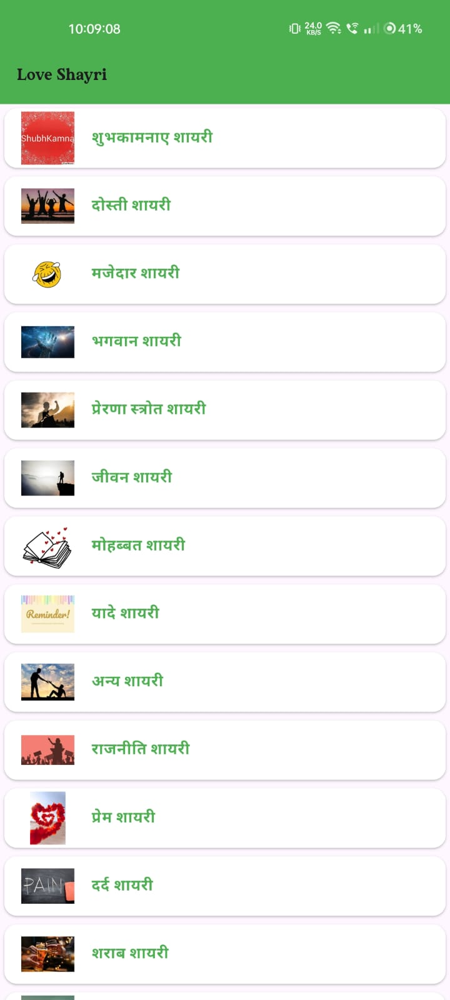
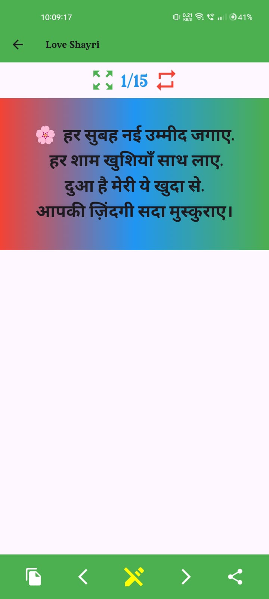
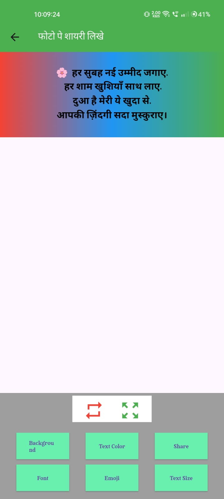
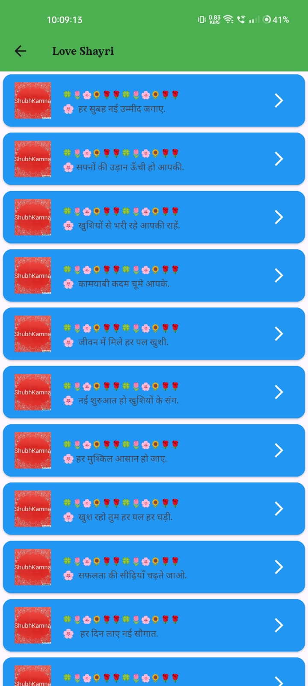
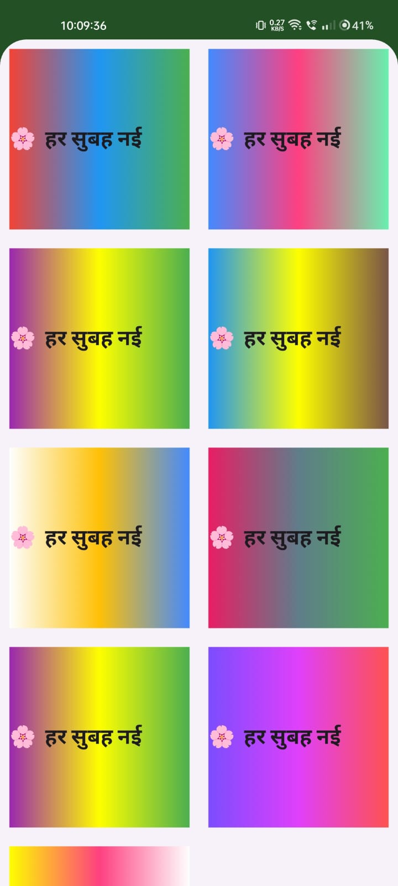

# ✍️ Shayari Studio - Flutter App

A professional Flutter-based Shayari application that allows users to browse, edit, and share beautiful poetry. This app features a built-in editor to customize the look and feel of each Shayari before sharing.

---

## ✨ Features

* **📖 Large Collection:** Access a vast library of Shayari across multiple categories.
* **🎨 Powerful Editor:** Customize Shayari with different background colors, text styles, and fonts.
* **📥 One-Tap Action:** Easily copy text to the clipboard or share it as an image on social media.
* **📱 Responsive UI:** A clean and modern user interface designed for a smooth user experience.

---

## 📸 Screenshots

| Home Screen | View List | Edit Mode |
| :---: | :---: | :---: |
|  |  |  |

| Details View | Options Menu 
| :---: | :---: 
|  |  
---

## 🛠️ Project Structure

Based on your actual project files:

```text
lib/
├── main.dart            # Entry point of the application
├── datamodel.dart       # Defines the data structures for Shayari
├── shyaricontaint.dart  # Manages the list of Shayari and content categories
├── fullshayri.dart      # Handles the full-screen display of a selected Shayari
└── editshayri.dart      # The core editing engine for styling and backgrounds

assets/
├── images/              # 20+ images including backgrounds (I1.jpeg - I16.jpeg)
└── Fonts/               # Custom artistic fonts for styling

```

----------

## 🚀 Installation & Setup

Follow these steps to run the project on your local machine:

1.  **Clone the Repository:**
    
    Bash
    
    ```
    git clone [https://github.com/dhruvin1112/shayari_app.git](https://github.com/dhruvin1112/shayari_app.git)
    
    ```
    
2.  **Navigate to the Project Folder:**
    
    Bash
    
    ```
    cd shayari_app
    
    ```
    
3.  **Fetch All Dependencies:**
    
    Bash
    
    ```
    flutter pub get
    
    ```
    
4.  **Run the Application:**
    
    Bash
    
    ```
    flutter run
    
    ```
    

----------

## ⚙️ Configuration (pubspec.yaml)

Make sure your assets are registered like this in your `pubspec.yaml` file:

YAML

```
flutter:
  assets:
    - assets/images/
    - assets/Fonts/

```

----------

## 👤 Author

**Dhruvin**

-   **GitHub:** [@dhruvin1112](https://github.com/dhruvin1112)
